Instalation of the packages needed for the work
===============================================

    knitr::opts_chunk$set(echo = FALSE)
    library(tidyverse)

    ## Warning: package 'tidyverse' was built under R version 3.4.1

    ## Loading tidyverse: ggplot2
    ## Loading tidyverse: tibble
    ## Loading tidyverse: tidyr
    ## Loading tidyverse: readr
    ## Loading tidyverse: purrr
    ## Loading tidyverse: dplyr

    ## Conflicts with tidy packages ----------------------------------------------

    ## filter(): dplyr, stats
    ## lag():    dplyr, stats

    library(socviz)
    library(gapminder)

    ## Warning: package 'gapminder' was built under R version 3.4.1

one other special package is required
-------------------------------------

Basics of the R language
========================

    ## [1]  1  2  3  1  3  5 25

There is a shortcut for the assignment operator that is \#\# ALT + -
--------------------------------------------------------------------

Functions
---------

    ## [1] 5.714286

    ## [1] 19.71429

    ## my_numbers
    ##  1  2  3  5 25 
    ##  2  1  2  1  1

    ## [1] 8.616153

    ## [1]  2  4  6  2  6 10 50

    ## [1]  2  3  4  2  4  6 26

    ## [1]  2  4  6  2  6 10 50

You can always ask the class
----------------------------

    ## [1] "numeric"

    ## [1] "summaryDefault" "table"

    ## [1] "function"

The class of the R objects can change as per below:

    ## [1] "1"     "2"     "3"     "1"     "3"     "5"     "25"    "Apple"

    ## [1] "character"

Note that in my\_new\_vector the numbers became characters therefore
they cannot be used as they are to make calculations. They need to be
converted back into numbers.

Data Frame
==========

    ##       fate    sex    n percent
    ## 1 perished   male 1364    62.0
    ## 2 perished female  126     5.7
    ## 3 survived   male  367    16.7
    ## 4 survived female  344    15.6

    ## [1] "data.frame"

In order to access to the data frame variables we use the dollar
operator ($)

    ## [1] 62.0  5.7 16.7 15.6

To see inside an object
=======================

The str function is very useful

    ##  num [1:7] 1 2 3 1 3 5 25

    ## Classes 'summaryDefault', 'table'  Named num [1:6] 1 1.5 3 5.71 4 ...
    ##   ..- attr(*, "names")= chr [1:6] "Min." "1st Qu." "Median" "Mean" ...

Let's start

    ## # A tibble: 6 × 6
    ##       country continent  year lifeExp      pop gdpPercap
    ##        <fctr>    <fctr> <int>   <dbl>    <int>     <dbl>
    ## 1 Afghanistan      Asia  1952  28.801  8425333  779.4453
    ## 2 Afghanistan      Asia  1957  30.332  9240934  820.8530
    ## 3 Afghanistan      Asia  1962  31.997 10267083  853.1007
    ## 4 Afghanistan      Asia  1967  34.020 11537966  836.1971
    ## 5 Afghanistan      Asia  1972  36.088 13079460  739.9811
    ## 6 Afghanistan      Asia  1977  38.438 14880372  786.1134

 \#\# Let's look at the data

We know the data but not the mapping

The geometry is missing and we add it like that

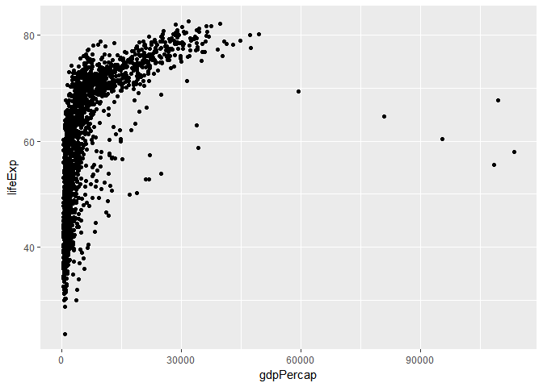
 We can add a trend line like that :

    ## `geom_smooth()` using method = 'gam'

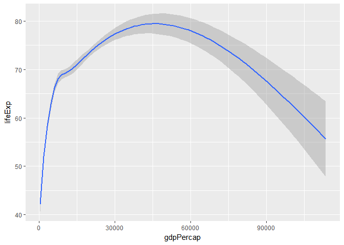

Only the line is showed. If I want to show the points and the line, I
have to put both in my chart like this:

    ## `geom_smooth()` using method = 'gam'

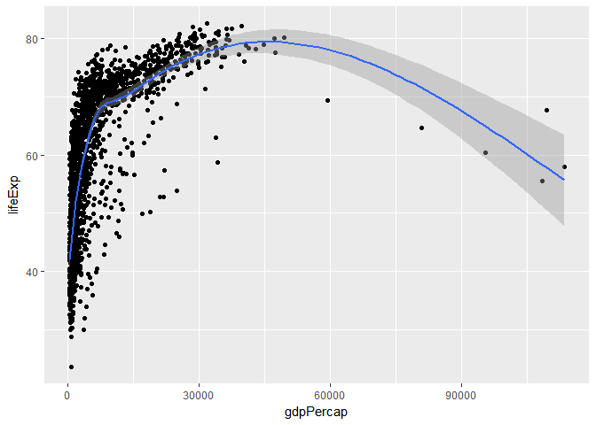

The function of the trend has been automatically chose by R. If I want
to specify the function as a line I can do the following:

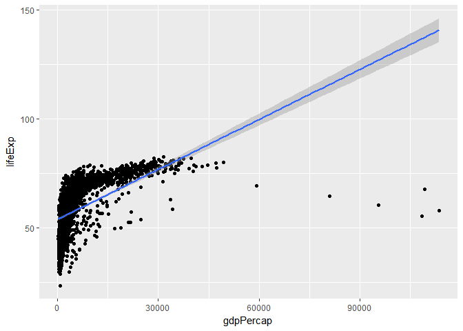
 

If I want to change the scale and
instead of plot x and y I want to plot them on a Log10 scale I can do
the following (first version is the explicit declaration then a function
is used)

 In the
case above the GAM function is used in the smooth. This is used to fit a
Generalized Additive Model.

That should be equivalent to this:

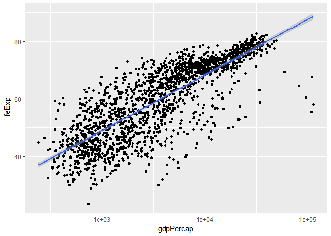 The
only difference is in the scale. Above I had the value of the Log. In
the second case instead I have the value de-logged.

Other useful transformation can be the following:

scale\_x\_sqrt() scale\_x\_reverse()

Let's try them both:

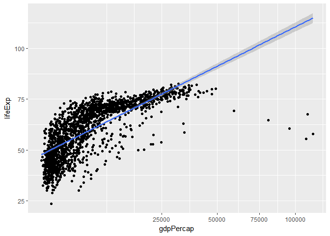

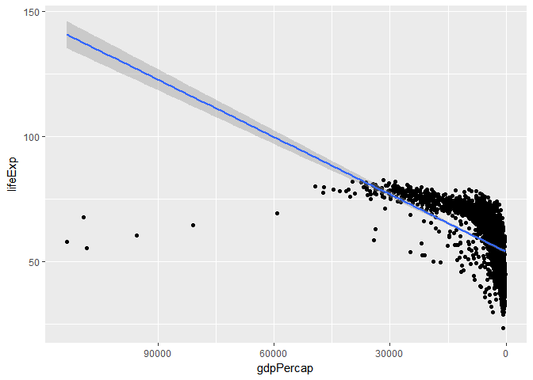

If we haven't loaded a library and we want to use a component of that
library we use the following syntax thelibrary::thefunction as in the
below:

 A part
from scales::dollar we have other function that we can use such as
scale::commas that we will try here below:

Now we can add more variables to our plot. Let's see how:

    ## `geom_smooth()` using method = 'loess'

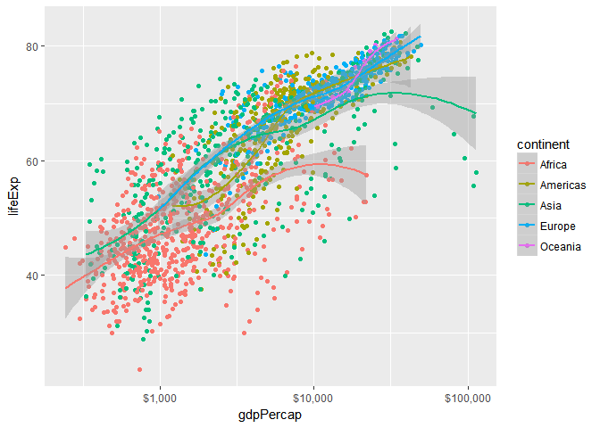 The
plot is very difficult to read and also there are 5 smoothers, one
foreach continent. This was my own plot, the book did not trace it.

Let's go back to what the book trace:

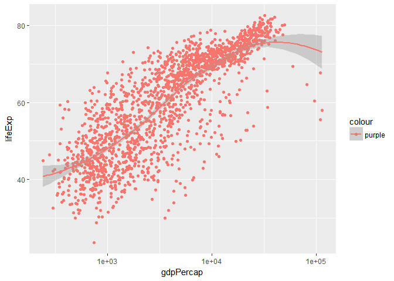 The
legend there is because we added the colour in the wrong place. Putting
it into the aes R reclycle the string, makes it a vector on the fly so a
new dimension is created similar to what happened before with the
continent.

Remember that the purple is the colour of the points so let's put it in
the right place as below:

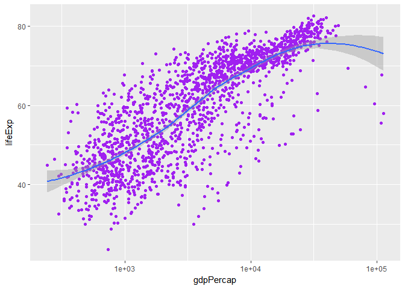
Attributes that are not typical of the mapping of the plot do not go
inside the aes function. Here below we set some parameters belonging to
smooth function. The se function switches of the standard error around
the trend line. The size is very high (to have a very thick line) and
the method is lm. Note that all these have been specified within the
smooth outside the mapping that is concerned just with what it has to be
mapped on the chart (the coordinates of the points)

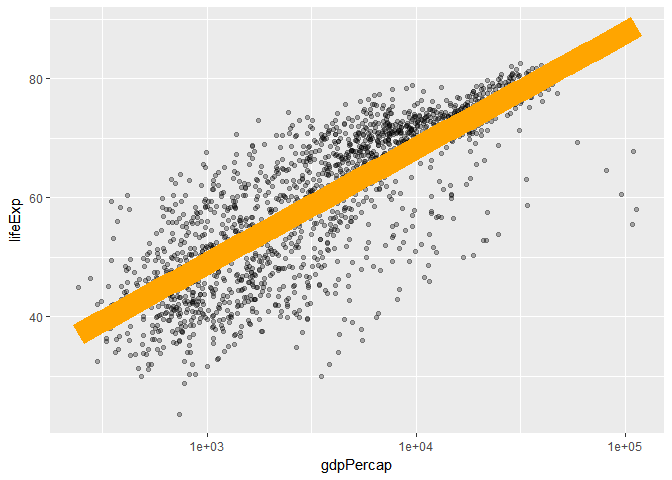

Now we can make a polished plot

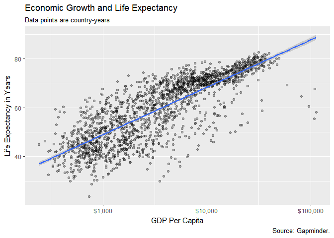

We can add in our chart the information about the Continent as well:

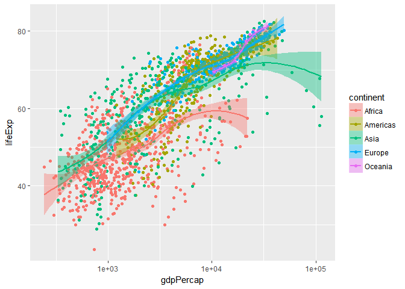 The
problem with the chart above is that is very confused. We have 5 lines
that are a little bit too many.

We can avoid it. Maybe just one line would be enough. This happens
because the geom\_ functions inherit the mapping from the ggplot
function that is in the layer above. But we can modify this redefying
the mapping in the geom\_ as well.

So we will not specify the color and fill in the ggplot function but in
the geom\_ we will say that we want the points colored by continent in
this way:

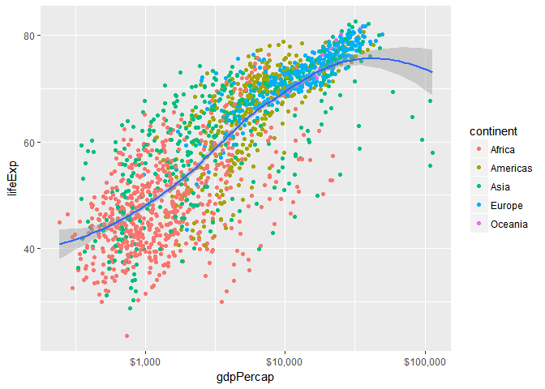

It is possible to map continuous variables to colors as well. Note that
the continent is a discrete or categorical variables (that assumes a
small number of values). We are going to see it with Population (pop).
It is better to cut a continuous variable into bins rather than using a
colour.

Group, facets and transform
===========================

Group
-----

We want to plot the trajectory of life expectancy over time for each
contry. We want to see that as years pass life expectancy increases.
Year will be our X variable and lifeExp Y.

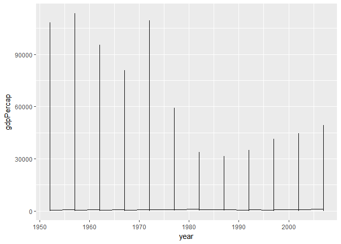 This
is not what we expected. Our data are for each contry, so we need to
tell this to ggplot. What ggplot is doing is the following: it finds a
series of year observations (e.g 1952 Afganistan, 1952 USA, 1952 Italy)
and put them all together. So it seems that we do not have some numbers
of observations by each year.

When ggplot gives a chart that is wrong but without an error being
produced it means that there is a mismatch between the data and the
aesthetics for the geometry being used. Therefore in the geom\_ we need
to redefine, customize the aesthetics in order for R doing what we want.

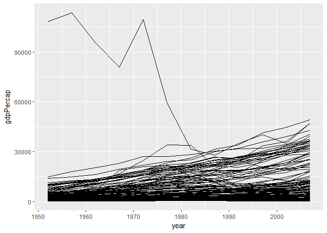

The outlier is Kuwait.

The previous with the previous plot was that ggplot could not know that
the year was grouped by country and this is what we tell in the geom\_
aesthetic.

Similar we can do:

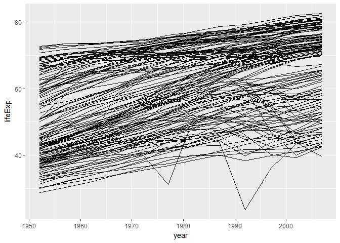

Facet
-----

The charts above are powerful but they are pretty unreadable. So we can
use facets, produce many little charts that we put back to back or
organise in a matrix to highlight differences.

Facets is not a geom\_ but a way to organise geometries. We use
facet\_wrap. Many arguments can be used but the most important is the
first one - the R formula which use the tilde char ~

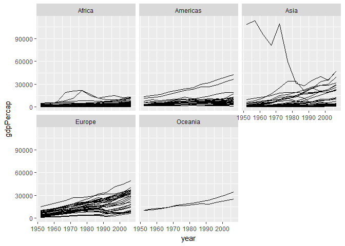 Let's
try to put all in one line with the trend line in each plot

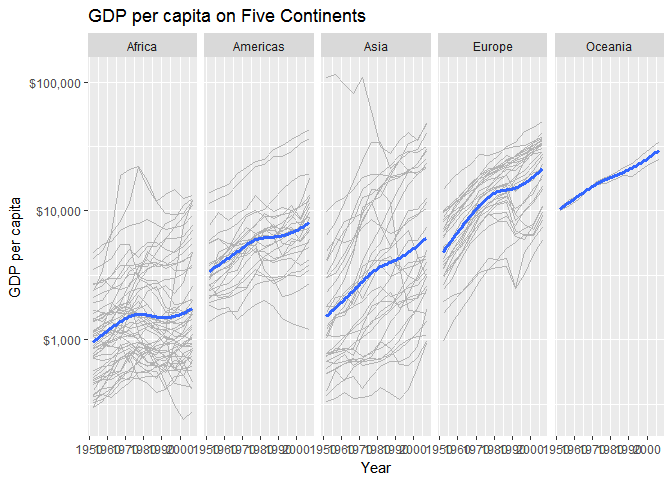 Facets
can do more that that. It is possible to cross-classify some data by two
categorical variables. In this case you use facet\_grid(). The plot will
be laid in a true two-dimensional arrangement.

We can see this on the diamonds dataset

    ## `geom_smooth()` using method = 'gam'

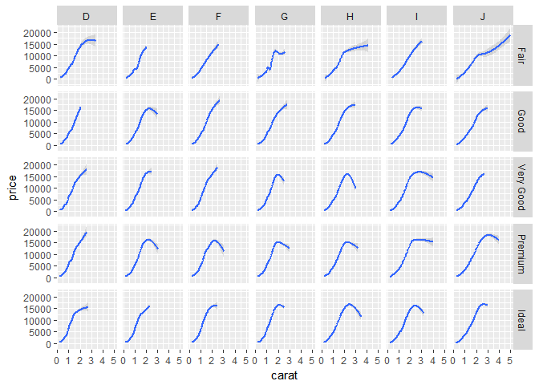 We
have 2 variables the cut (fair, good, fairy good, premium, ideal) and
the color (D, E, F, G, H, I, J). For each of the 35 combinations
facet\_grid makes a chart of the carat vs price.

Further CATEGORICAL variables can be added (e.g cut ~ color + clarity)
There is a difference if you write the formula like that cut ~ color or
~ cut + color

    ## `geom_smooth()` using method = 'gam'

Geom
----

Every geom\_ function has an associated stat\_ function that it uses by
default

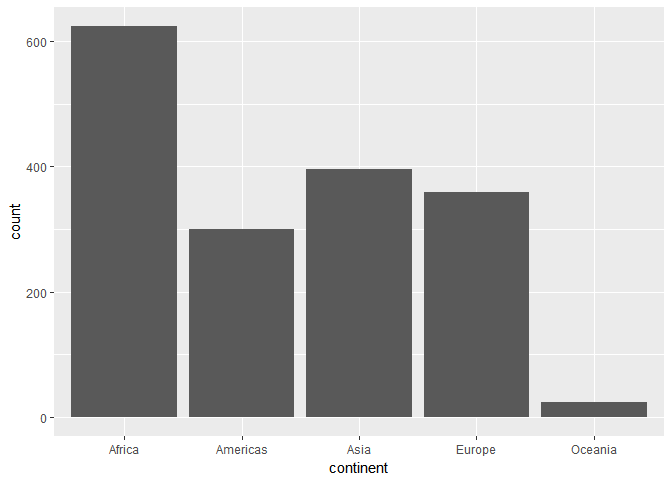 The
chart above represent the count by continent of the points. This is
because the bar has the stat\_count as default.
