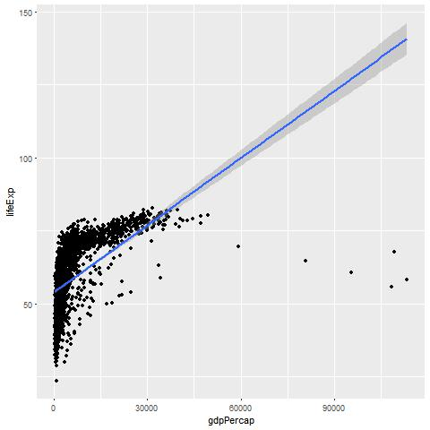
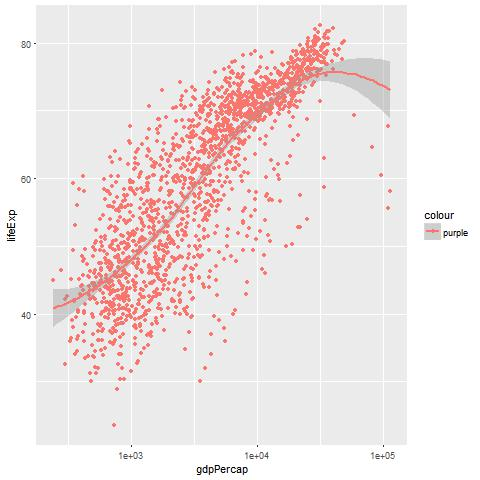

Instalation of the packages needed for the work
===============================================

    knitr::opts_chunk$set(echo = FALSE)
    library(tidyverse)

    ## Warning: package 'tidyverse' was built under R version 3.4.1

    ## Loading tidyverse: ggplot2
    ## Loading tidyverse: tibble
    ## Loading tidyverse: tidyr
    ## Loading tidyverse: readr
    ## Loading tidyverse: purrr
    ## Loading tidyverse: dplyr

    ## Conflicts with tidy packages ----------------------------------------------

    ## filter(): dplyr, stats
    ## lag():    dplyr, stats

    library(socviz)
    library(gapminder)

    ## Warning: package 'gapminder' was built under R version 3.4.1

one other special package is required
-------------------------------------

Basics of the R language
========================

    ## [1]  1  2  3  1  3  5 25

There is a shortcut for the assignment operator that is \#\# ALT + -
--------------------------------------------------------------------

Functions
---------

    ## [1] 5.714286

    ## [1] 19.71429

    ## my_numbers
    ##  1  2  3  5 25 
    ##  2  1  2  1  1

    ## [1] 8.616153

    ## [1]  2  4  6  2  6 10 50

    ## [1]  2  3  4  2  4  6 26

    ## [1]  2  4  6  2  6 10 50

You can always ask the class
----------------------------

    ## [1] "numeric"

    ## [1] "summaryDefault" "table"

    ## [1] "function"

The class of the R objects can change as per below:

    ## [1] "1"     "2"     "3"     "1"     "3"     "5"     "25"    "Apple"

    ## [1] "character"

Note that in my\_new\_vector the numbers became characters therefore
they cannot be used as they are to make calculations. They need to be
converted back into numbers.

Data Frame
==========

    ##       fate    sex    n percent
    ## 1 perished   male 1364    62.0
    ## 2 perished female  126     5.7
    ## 3 survived   male  367    16.7
    ## 4 survived female  344    15.6

    ## [1] "data.frame"

In order to access to the data frame variables we use the dollar
operator ($)

    ## [1] 62.0  5.7 16.7 15.6

To see inside an object
=======================

The str function is very useful

    ##  num [1:7] 1 2 3 1 3 5 25

    ## Classes 'summaryDefault', 'table'  Named num [1:6] 1 1.5 3 5.71 4 ...
    ##   ..- attr(*, "names")= chr [1:6] "Min." "1st Qu." "Median" "Mean" ...

Let's start

    ## # A tibble: 6 × 6
    ##       country continent  year lifeExp      pop gdpPercap
    ##        <fctr>    <fctr> <int>   <dbl>    <int>     <dbl>
    ## 1 Afghanistan      Asia  1952  28.801  8425333  779.4453
    ## 2 Afghanistan      Asia  1957  30.332  9240934  820.8530
    ## 3 Afghanistan      Asia  1962  31.997 10267083  853.1007
    ## 4 Afghanistan      Asia  1967  34.020 11537966  836.1971
    ## 5 Afghanistan      Asia  1972  36.088 13079460  739.9811
    ## 6 Afghanistan      Asia  1977  38.438 14880372  786.1134

Let's look at the data
----------------------

We know the data but not the mapping

The geometry is missing and we add it like that

We can add a trend line like that :

    ## `geom_smooth()` using method = 'gam'

Only the line is showed. If I want to show the points and the line, I
have to put both in my chart like this:

    ## `geom_smooth()` using method = 'gam'

The function of the trend has been automatically chose by R. If I want
to specify the function as a line I can do the following:

 

If I want to change the scale and instead of
plot x and y I want to plot them on a Log10 scale I can do the following
(first version is the explicit declaration then a function is used)

 

In the case above the GAM function is used in the smooth. This is used to fit a
Generalized Additive Model.

That should be equivalent to this:

 

The only difference is in the scale. Above I had the value of the Log. In the
second case instead I have the value de-logged.

Other useful transformation can be the following:

scale\_x\_sqrt() scale\_x\_reverse()

Let's try them both:

If we haven't loaded a library and we want to use a component of that
library we use the following syntax thelibrary::thefunction as in the
below:

 

A part from scales::dollar we have other function that we can use such as
scale::commas that we will try here below:

Now we can add more variables to our plot. Let's see how:

    ## `geom_smooth()` using method = 'loess'

 

The plot is very difficult to read and also there are 5 smoothers, one foreach
continent. This was my own plot, the book did not trace it.

Let's go back to what the book trace:

 

The legend there is because we added the colour in the wrong place. Putting
it into the aes R reclycle the string, makes it a vector on the fly so a
new dimension is created similar to what happened before with the
continent.

Remember that the purple is the colour of the points so let's put it in
the right place as below:

Attributes that are not typical of the mapping of the plot do not go
inside the aes function. Here below we set some parameters belonging to
smooth function. The se function switches of the standard error around
the trend line. The size is very high (to have a very thick line) and
the method is lm. Note that all these have been specified within the
smooth outside the mapping that is concerned just with what it has to be
mapped on the chart (the coordinates of the points)

Now we can make a polished plot

We can add in our chart the information about the Continent as well:

 

The problem with the chart above is that is very confused. We have 5 lines
that are a little bit too many.

We can avoid it. Maybe just one line would be enough. This happens
because the geom\_ functions inherit the mapping from the ggplot
function that is in the layer above. But we can modify this redefying
the mapping in the geom\_ as well.

So we will not specify the color and fill in the ggplot function but in
the geom\_ we will say that we want the points colored by continent in
this way:

It is possible to map continuous variables to colors as well. Note that
the continent is a discrete or categorical variables (that assumes a
small number of values). We are going to see it with Population (pop).
It is better to cut a continuous variable into bins rather than using a
colour.

Group, facets and transform
===========================

## Group
-----

We want to plot the trajectory of life expectancy over time for each
contry. We want to see that as years pass life expectancy increases.
Year will be our X variable and lifeExp Y.

 

This is not what we expected. Our data are for each contry, so we need to tell
this to ggplot. What ggplot is doing is the following: it finds a series
of year observations (e.g 1952 Afganistan, 1952 USA, 1952 Italy) and put
them all together. So it seems that we do not have some numbers of
observations by each year.

When ggplot gives a chart that is wrong but without an error being
produced it means that there is a mismatch between the data and the
aesthetics for the geometry being used. Therefore in the geom\_ we need
to redefine, customize the aesthetics in order for R doing what we want.

The outlier is Kuwait.

The previous with the previous plot was that ggplot could not know that
the year was grouped by country and this is what we tell in the geom\_
aesthetic.

Similar we can do:

Facet
-----

The charts above are powerful but they are pretty unreadable. So we can
use facets, produce many little charts that we put back to back or
organise in a matrix to highlight differences.

Facets is not a geom\_ but a way to organise geometries. We use
facet\_wrap. Many arguments can be used but the most important is the
first one - the R formula which use the tilde char ~

 

Let's try to put all in one line with the trend line in each plot

 

Facets can do more that that. It is possible to cross-classify some data by two
categorical variables. In this case you use facet\_grid(). The plot will
be laid in a true two-dimensional arrangement.

We can see this on the diamonds dataset

    ## `geom_smooth()` using method = 'gam'

 

We have 2 variables the cut (fair, good, fairy good, premium, ideal) and the color
(D, E, F, G, H, I, J). For each of the 35 combinations facet\_grid makes
a chart of the carat vs price.

Further CATEGORICAL variables can be added (e.g cut ~ color + clarity)
There is a difference if you write the formula like that cut ~ color or
~ cut + color

    ## `geom_smooth()` using method = 'gam'

Geom
----

Every geom\_ function has an associated stat\_ function that it uses by
default

 

The chart above represent the count by continent of the points. This is because
the bar has the stat\_count as default.

We need to notice that the y-axis contains the variable 'count' that is
not in the data. Ggplot is counting the couple year-country for us
automatically. This is done using the stat\_ function associated with it
in this case stat\_count(). This function has computed 2 new vars count
and prop (proportion). stat\_count is used by default by geom\_bar()

The .. before and after the variable names is to make sure these
variables are not confused with others that can possibly exist.

We are trying to make a chart with the proportion of observations per
country. What is happening with the chart above is that the denominator
is the number of observation by contient, that's why it is always giving
us 100%. It is the opposite problem of the grouping because we need to
tell R to consider as denominator the total number of observations. So
we need to tell ggplot to ignore the x category when calculating the
denominator of the proportion and use the total. We do that using group
= 1 inside the aes call. 1 is a dummy value to say to use the whole
dataset when establishing the denominator for the proportion

In order to show other function of geom\_bar we will use another dataset
containing more categorical variables. This is the General Social Survey
(GSS). It is in the socviz package. We see the results of the question
what is your religion:

    ## 
    ## Protestant   Catholic     Jewish       None      Other 
    ##       1371        649         51        619        159

We want a bar chart coloured by religion. So religion should be in the
fill.

We need to remember that mapping religion to color will just give the
color to the external shape but the inside will stay gray. If we want to
fill we need to use fill

guides(fill = FALSE) helps the name not to go one over the other. Also
the legend is removed. The legend is there because we mapped the same
variable (religion) on 2 aesthetics (x and color/fill).

The fill aesthetics can be used to show 2 variables at once. The dataset
has another variable called big region that can be broken down by
religion in this way:

It is difficult to see the position of the Catholics in the different
regions therefore we can do as follow:

If we want stacked bars we use dodge:

We loose the proportion because the count takes over so we can use the
very same trick we used above:

We need to say that the denominator of the proportion should be the
total and not what there is in the bigregion. We do that using group. We
want that the sum of the percentages in each bigregion is 100% so
religion should be the variable we group by in order to calculate the
proportions.

The above is not quite right because the objective was not achieved. In
fact if you sum the percentages within big region you do not get to 100%
but you get to 100% if you sum the same religion across the big regions.
This is what we said when we said group = religion (if catholics are 100
across the 4 regions give me the percentage). We should group by 2
things, the religion and the big region. So if I have 100 in the
Northeast and 50 are catholic is do 50/100.

    ##            
    ##             Protestant Catholic Jewish None Other
    ##   Northeast        158      162     27  112    28
    ##   Midwest          325      172      3  157    33
    ##   South            650      160     11  170    50
    ##   West             238      155     10  180    48

If we want to calculate the percentages, there is some work to do but
eventually we arrive there:

    ##           Protestant Catholic Jewish   None     Other   
    ## Northeast "11.5 %"   "25.0 %" "52.9 %" "18.1 %" "17.6 %"
    ## Midwest   "23.7 %"   "26.5 %" "5.9 %"  "25.4 %" "20.8 %"
    ## South     "47.4 %"   "24.7 %" "21.6 %" "27.5 %" "31.4 %"
    ## West      "17.4 %"   "23.9 %" "19.6 %" "29.1 %" "30.2 %"

Let's work with our data to have the right numbers to plot:

    ## Source: local data frame [24 x 5]
    ## Groups: bigregion [4]
    ## 
    ##    bigregion   religion     N        freq   pct
    ##       <fctr>     <fctr> <int>       <dbl> <dbl>
    ## 1  Northeast Protestant   158 0.323770492  32.4
    ## 2  Northeast   Catholic   162 0.331967213  33.2
    ## 3  Northeast     Jewish    27 0.055327869   5.5
    ## 4  Northeast       None   112 0.229508197  23.0
    ## 5  Northeast      Other    28 0.057377049   5.7
    ## 6  Northeast         NA     1 0.002049180   0.2
    ## 7    Midwest Protestant   325 0.467625899  46.8
    ## 8    Midwest   Catholic   172 0.247482014  24.7
    ## 9    Midwest     Jewish     3 0.004316547   0.4
    ## 10   Midwest       None   157 0.225899281  22.6
    ## # ... with 14 more rows

In order to check if we got the calculation right, the percentage in
each region should amount to 100%. We can check if this is the case with
the following code:

    ## # A tibble: 4 × 2
    ##   bigregion total
    ##      <fctr> <dbl>
    ## 1 Northeast 100.0
    ## 2   Midwest  99.9
    ## 3     South 100.0
    ## 4      West 100.1

Now we can do our plot:

 

Not all times we need to transform data. When we do not have we can plot them
directly like the example below that uses the aggregated data from the
Titanic. We could use geom\_bar(stat = "identity") but a shorter
alternative is geom\_col let's see:

The position argument can be used in both geom\_bar() and geom\_col().
It can also take the value of "identity". stat="identity" means don't do
any summary calculations position = "identity" means just plot the
values as given. This allows us to plot a flow of positive and negative
values in a bar charts. We see that with some CO2 concentration data.

    ##       conc       date  diff   pos
    ## 301 343.52 1984-01-01 -10.7 FALSE
    ## 302 344.33 1984-02-01  -9.9 FALSE
    ## 303 345.11 1984-03-01  -9.1 FALSE
    ## 304 346.88 1984-04-01  -7.3 FALSE
    ## 305 347.25 1984-05-01  -7.0 FALSE
    ## 306 346.62 1984-06-01  -7.6 FALSE

We used geom\_col() that is very good and short. If we used geom\_bar we
should have specified the argument position in the following way
geom\_bar(position = "identity"). The guides function with fill = FALSE
drops the legend.

Transform Histograms and Density Plots
--------------------------------------

When we have a continuous variable plotting in a histogram is not the
smartest thing to do. We can transform the variable making the chart
more meaningful. We will work with the dataset midwest coming with
ggplot that contains country data for the midwest region of the US.

    ## `stat_bin()` using `bins = 30`. Pick better value with `binwidth`.

Above we are comparing the distribution of two of the states that we
chose.

When we work with continuous variable an alternative to bins is a kernel
density estimate of the underlying distribution. The function
geom\_density() does that for us:

 

We can ask geom\_density to return some statistics such as: 

- ..density.. 
- ..scaled.. (proportional density scaled to a max of 1) 
- ..count..  (density times the number of points)

!Figure 44[Figure 44](figures/Chart_44.jpeg)